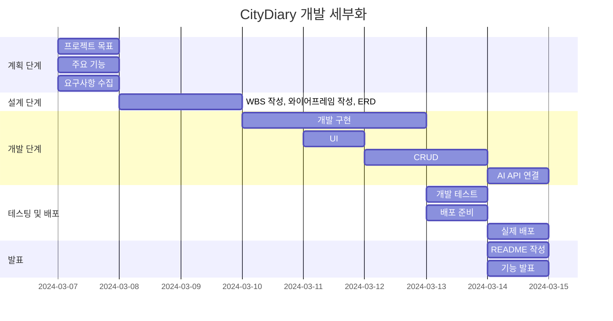

# Portfolio_CityDiary

### 💻 프로젝트 소개
>**Django Project**  
>**blog 만들기**  
>**이 프로젝트는 블로그의 기본 기능인 CRUD(Create, Read, Update, Delete)를 구현하고 로그인과 회원가입 기능을 포함합니다.**  
>**더불어 추가적인 기능을 개발하고 배포하는 것이 주요 목표입니다.**

### 🧠 개발 동기
>**SNS의 아이콘인 ☆그램에서 영감을 받았습니다.**  
>**일상 속 사진과 영상을 공유하는 콘텐츠는 유사하지만, AI 기술을 활용하여 독특한 차별점을 만들고자 합니다.**  
>**이 프로젝트의 초기 목표는 AI를 활용하여 블로그 글을 자동으로 요약하여 사용자에게 제공하는 기능을 구현하는 것입니다.**

### 🕰 개발 기간
>**2024-03-07 ~ 2024-03-13**

### ⚙ 개발 환경
>**IDE : Visual Studio Code**  
>**Web Framework : Django 5.0.2**  
>**배포 URL : **

### 🚩 프로젝트 목표
>****

### 📌 기능
>**회원가입**  
>**로그인**  
>**로그아웃**  
>**탈퇴하기**  
>**글 작성하기**  
>**글 수정하기**  
>**글 삭제하기**  
>**첨부파일 올리기**  
>**댓글 달기**  
>**댓글 삭제**  
>**본문 자동 요약**

### 📂 파일 구조

### 🔎 WBS
>**일정표는 머메이드로 작성**

### 📏 와이어프레임
>**메인 페이지**

>**읽기 페이지**

>**등록 / 수정 페이지**

>**로그인 / 회원가입 페이지**

>**로그인 / 회원가입 실패 시 페이지**

### 👤 사용자

### 📱 구현 화면

### 💥 에러와 해결 1

### 💥 에러와 해결 2

### ➕ 추가할 기능

### 💭 프로젝트 회고

### 👨🏻‍🏫 피드백
