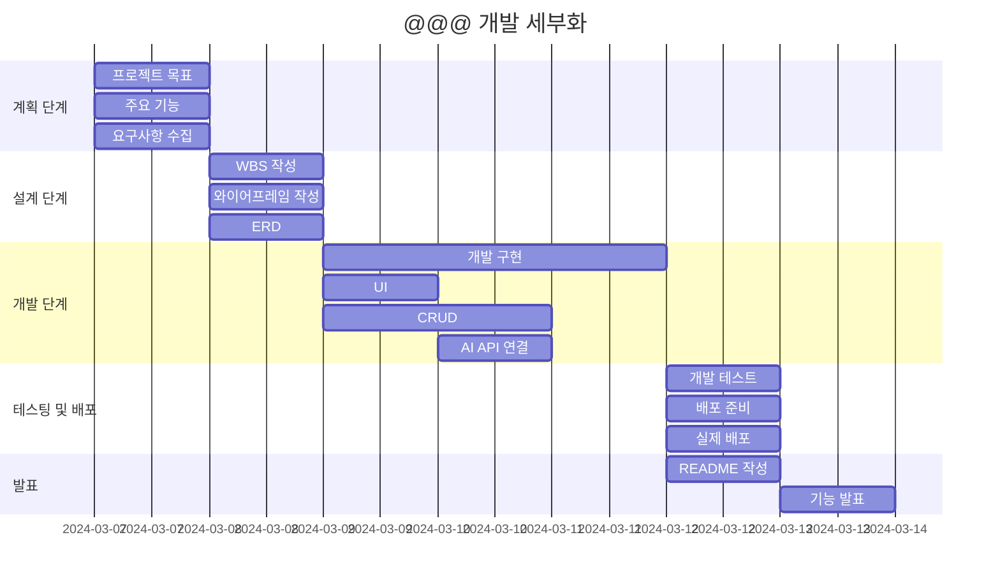

# Portfolio_

### 💻 프로젝트 소개
>**Django Project**  
>**blog 만들기**  
>**블로그의 기능인 CRUD 구현과 로그인, 회원가입을 이용하기 그 외 추가 기능 작성 및 배포가 주된 프로젝트입니다.**

### 🧠 개발 동기
>**SNS의 아이콘인 ☆그램을 통해 아이디어를 얻었습니다.**  
>**일상 속 사진과 영상등을 공유하는 부분에서 공통점이 있지만 다른 차별점을 위해 AI 기술을 접목시켰습니다.**  
>**AI는 본문의 내용을 작성해주는 기술을 구현하는 것을 목표로 시작되었습니다.**

### 🕰 개발 기간
>**2024-03-07 ~ 2024-03-13**

### ⚙ 개발 환경
>**IDE : Visual Studio Code**  
>**Web Framework : Django 5.0.2**  
>**배포 URL : **

### 🚩 프로젝트 목표
>****

### 📌 기능
>**회원가입**  
>**로그인**  
>**로그아웃**  
>**탈퇴하기**  
>**글 작성하기**  
>**글 수정하기**  
>**글 삭제하기**  
>**첨부파일 올리기**  
>**댓글 달기**  
>**댓글 삭제**  
>**본문 자동생성**

### 📂 파일 구조

### 🔎 WBS
>**일정표는 머메이드로 작성**

### 📏 와이어프레임
|메인 페이지|||
||
|읽기 페이지|
|

### 👤 사용자

### 📱 구현 화면

### 💥 에러와 해결 1

### 💥 에러와 해결 2

### ➕ 추가할 기능

### 💭 프로젝트 회고

### 👨🏻‍🏫 피드백
