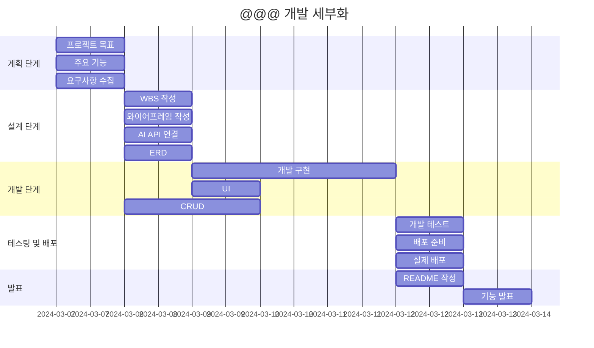

# Portfolio_

### 💻 프로젝트 소개
>**Django Project**  
>**blog 만들기**  

### 🧠 개발 동기

### 🕰 개발 기간
>**2024-03-07 ~ 2024-03-13**

### ⚙ 개발 환경
>**IDE : **  
>**Code : **  
>**배포 URL : **

### 🚩 프로젝트 목표

### 📌 기능

### 📂 파일 구조

### 🔎 WBS
>**일정표는 머메이드로 작성**

### 📏 와이어프레임

### 👤 사용자

### 📱 구현 화면

### 💥 에러와 해결 1

### 💥 에러와 해결 2

### ➕ 추가할 기능

### 💭 프로젝트 회고

### 👨🏻‍🏫 피드백
